# Github Pages + Hugo 搭建个人博客

## 零、效果

本次配置最终效果图：

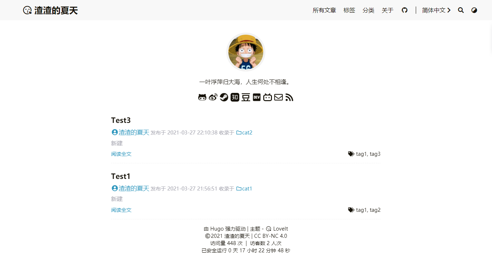

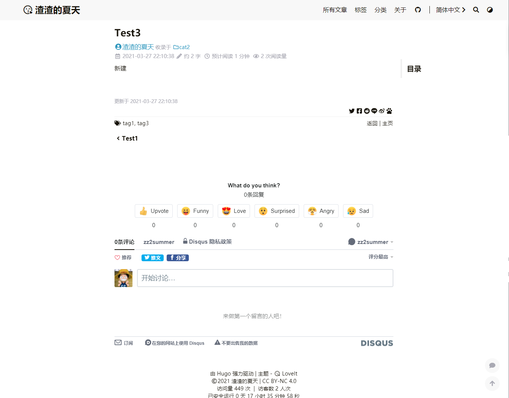

快速搭建方式，直接下载修改后的模板改也是可以的：https://github.com/zz2summer/blog-hugo-theme-LoveIt

完成步骤一、二、三，然后下载上述文件到 blog 目录下就可以跳过第四步了。

## 一、创建 Github 库

1. 打开 Github ，新建一个库。

   

2. 输入项目名，要与 Github 用户名一致。比如我的是 zz2summer，那么输入的 Repository name 就是 `zz2summer.github.io`，README 也一并勾选上。

   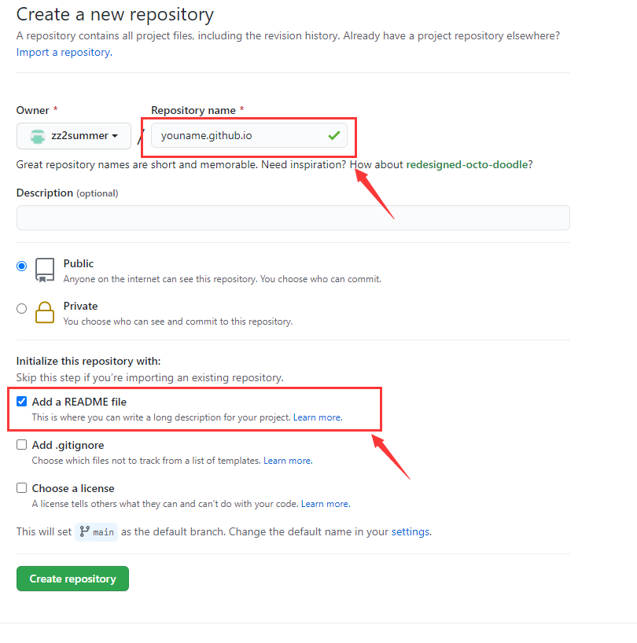


## 二、安装 Hugo 和 Git

1. 查阅 Hugo 安装指南：[Install Hugo | Hugo](https://gohugo.io/getting-started/installing/)，找到对应系统的安装操作。

   基本上都是使用各个包工具安装，本人 Win10，比较嫌麻烦就直接下载使用。

2. 打开 Github 中的 [Hugo](https://github.com/gohugoio/hugo) 库，打开右侧的 Realeases，下载最新的版本，本次下载为：[hugo_extended_0.82.0_Windows-64bit.zip](https://github.com/gohugoio/hugo/releases/download/v0.82.0/hugo_extended_0.82.0_Windows-64bit.zip)

   下载 extened 版本是因为有些主题的需要利用进行 SCSS/SASS 构建，如果下普通版就可能会报错显示： you need the extended version to build SCSS/SASS

3. 解压后，将其中的 `hugo.exe` 放到指定的安装目录，比如 `D:\softwares\Hugo\bin`，然后将该目录添加到系统环境变量（win+R → sysdm.cpl → 高级 → 环境变量 → 系统变量 Path）的 `Path` 下。

4. 打开命令行，输入 `hugo version`，显示版本号即为安装成功

   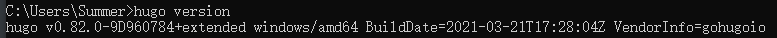

5. 本地下载 [Git](https://git-scm.com/) ，Win10直接下载 exe ，点击下一步就好了。

## 三、新建 Hugo 网站

1. 新建一个目录，用于存放 Hugo 网站的文件，比如：H:\HugoWebsite

2. 打开命令行，切换到该目录，执行命令新建一个 Hugo 网站

   ```go
   # blog 是网站文件夹名
   hugo new site blog
   ```

   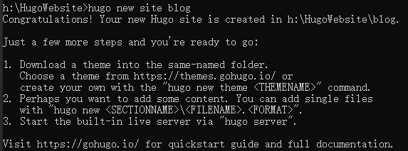

## 四、选择 Hugo 主题

1. 打开 hugo theme 的网站，选择合适的主题，以**Tranquilpeak** 举例。

   Hugo Themes: [https://themes.gohugo.io](https://themes.gohugo.io)

2. 将选中的主题下载到本地

   ```bash
   # 进入网站目录 blog
   cd blog
   # 进入 themes 目录，一般默认有，如果没有自行创建：mkdir -p themes
   cd themes
   # 下载主题到 tranquilpeak 文件夹下
   git clone https://github.com/kakawait/hugo-tranquilpeak-theme.git tranquilpeak
   ```

   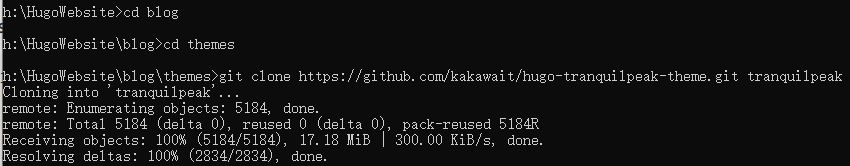
   
3. 此处建议选择的这个主题相较适合第一次尝试，配置文件比较详细明了。待熟悉后，可以自行选择主题。

   Hugo主题库：https://themes.gohugo.io，个人推荐主题：https://github.com/dillonzq/LoveIt.git
   
4. 在 Hugo 网站的根目录下（上文提及的 HugoWebsite）配置 config.toml

   详细配置参考：[hugo-tranquilpeak-theme/user.md at master · kakawait/hugo-tranquilpeak-theme](https://github.com/kakawait/hugo-tranquilpeak-theme/blob/master/docs/user.md)

5. 当前工作目录：H:\HugoWebsite\blog，备份 config.toml 原文件，然后将 themes/tranquilpeak/exampleSite/config.toml 复制过来覆盖原文件，打开 config.toml 阅读并修改配置

   简单讲就是利用已经配置好的主题配置文件进行修改。

## 五、新建文章

1. 进入网站文件夹根目录：H:\HugoWebsite\blog，鼠标右键选择 Git Bash Here

2. 新建文章：first-post.md，**注意区分主题的要求，有些主题新建文章的目录是 posts **

   ```bash
   hugo new post/first-post.md
   ```

3. 编辑文章内容，保存。

   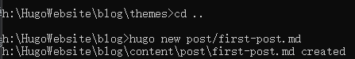

4. 启动 Hogo server

   ```bash
   hugo server -D
   ```

   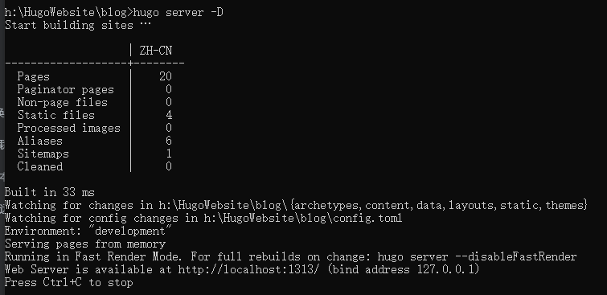

5. 打开网址 http://localhost:1313/ 可以进行预览

   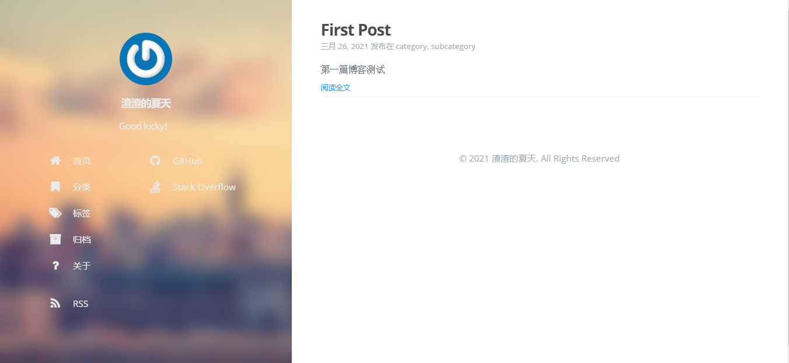

   如果发现预览效果不满意，可以 编辑 config.toml 文件

## 六、部署到 Github

1. 构建 Hugo 网站

   在 Hugo 网站文件夹的根目录（H:\HugoWebsite\blog）下执行 `hugo` 命令构建

   

   Hugo 会将构建的网站内容默认保存至网站根目录下的 public/ 文件夹下。

2. 将网站文件夹与 GitHub 建立联系**（仅第一次运行需要）**

   - 进入 H:\HugoWebsite\blog\public 目录，初始化 Git 库

     生成的 HTML 文件保存在 "public" 目录中，"public" 文件夹会被转换为 Git 库。

     ```bash
     git init
     ```

     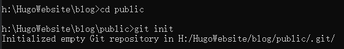

   - 将 Git 本地库关联至远程库

     在 H:\HugoWebsite\blog\public 目录下，为 Git 本地库添加远程库，"git@github.com:your-github-id/your-github-id.github.io.git"

     ```bash
     git remote add origin git@github.com:zz2summer/zz2summer.github.io.git
     ```

3. 提交修改

   在 `H:\HugoWebsite\blog\public` 目录下，通过如下命令提交：

   ```bash
   # 查看当前修改状态
   git status
   # 添加修改过得文件，  . 表示所有，也可以指定文件
   git add .
   # ""里面的内容就是提交内容的说明信息
   git commit -m "first commit"
   ```
   
4. 提交修改至远程库
   
   在 `H:\HugoWebsite\blog\public` 目录下，通过如下命令提交：
   
   ```bash
   git push -u origin master
   ```
   
    然后如果按照博客顺序操作，第一次应该失败的。
   
   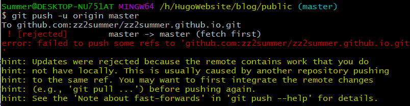
   
   因为本地的 git 库和远程的库并不是一致的，需要进行一次 pull 操作才能继续 push。
   
   第一种解决办法就是加参数 -f ，强制推送，但是这样很危险，会导致其他的更新提交失败，也就是说原来该库下所有文件都会被删除掉，只剩下本次提交的文件了。日常不建议这么操作，但是其实本次第一次是可以的，因为当前库下没有还没有有效文件。
   
   ```bash
   git push -u -f origin master
   ```
   
   第二种方案为：先把除 .git 文件夹外的所有文件复制到其他目录备份，然后 git pull 当前库下的文件下来，然后把这些文件和自己需要的文件结合处理好（本次就是删除这些文件，再把原文件复制回来），重新提交即可。日常推荐这种方法，养成好习惯。
   
   ```bash
   # 1.移动除 .git 外的文件到另一个目录下
   # 2.pull 该库当前文件，最后的参数是因为合并两个不相关的项目（即，不知道彼此存在并且提交历史不匹配的项目）时，会发生Git错误：fatal: refusing to merge unrelated histories，此时出现记录文件，先按住 ctrl+:，再输入 wq 即可。
   git pull origin master --allow-unrelated-histories
   # 3.合并这些文件和第一次移动出去的文件，本次就是删除这些文件，把那些文件移动回来就好了
   # 4.提交本地
   git add .
   git commit -m "first commit"
   # 5.提交远程
   git push -u origin master
   ```
5. 好了，第一次初始化配置也就成功完成了！输入：https://zz2summer.github.io/ 就可以访问部署的网站了。
   

## 七、日常操作

### 1. 新建文章

```bash
# 1.新建一篇文章，在网站根目录：H:\HugoWebsite\blog
hugo new post/第二篇测试博客.md
# 2.在目录 H:\HugoWebsite\blog\content\post 下找到对应文件进行修改
# 3.本地预览, http://localhost:1313/ 
hugo server -D
# 4.构建 Hugo 网站
hugo
# 5.切换到目录 H:\HugoWebsite\blog\public ，提交修改至本地库
git add .
git commit -m 'commit info'
# 6.将修改推至远程库
git push -u origin master
```

### 2. 修改文章

```bash
# 1.当前工作目录：H:\HugoWebsite\blog
# 2.在目录 H:\HugoWebsite\blog\content\post 下找到对应文件
进行修改
# 3.本地预览, http://localhost:1313/ 
hugo server -D
# 4.构建 Hugo 网站
hugo
# 5.切换到目录 H:\HugoWebsite\blog\public ，提交修改至本地库
git add .
git commit -m 'commit info'
# 6.将修改推至远程库
git push -u origin master
```

### 3. 删除文章

```bash
# 1.当前工作目录：H:\HugoWebsite\blog
# 2.删除两处文件
在目录 H:\HugoWebsite\blog\content\post 、H:\HugoWebsite\blog\public  下找到对应文件进行删除
其中 public 下文件不删除也不影响显示，只是该文件就会一直存在，另外该目录下即便文件（除.git)删错或者全部删除也是不影响的，应为 hugo 命令会全部重建
# 3.本地预览, http://localhost:1313/ 
hugo server -D
# 4.构建 Hugo 网站
hugo
# 5.切换到目录 H:\HugoWebsite\blog\public ，提交修改至本地库
git add .
git commit -m 'commit info'
# 6.将修改推至远程库
git push -u origin master
```


### 4.添加图片

Hugo 的配置文件和文章中引用图片都是从`static`作为根目录的。（H:\HugoWebsite\blog\static）

也就是说首先要将图片放置到 `static` 文件夹下，以 `static` 为相对路径，然后进行引用，方式为：``，当然这样该 .md 文件中是不会显示，本地预览和部署后是可以看到的

正常做法：

1. 写文章时，在该文章目录下新建文件夹存放照片，引用时采用相对路径。
2. 完成之后，在引用路径前加个 `/`，比如原来引用方式 `` ，需要修改为 `` 。
3. 之后将该图片文件夹移动到 static 目录下即可。

### 5. 图片加水印

1. 找一份字体放到根目录下（H:\HugoWebsite\blog）。

   （win10自带字体文件目录：C:\Windows\Fonts）

2. 创建 watermark.py 

3. 然后每次写完一篇文章可以运行`python watermark.py postname`添加水印。

   如果第一次运行要给所有文章添加水印，可以运行`python watermark.py all`。

```py
# -*- coding: utf-8 -*-
import sys
import glob
from PIL import Image
from PIL import ImageDraw
from PIL import ImageFont


def watermark(post_name):
    if post_name == 'all':
        post_name = '*'
    dir_name = 'static/' + post_name + '/*'
    for files in glob.glob(dir_name):
        im = Image.open(files)
        if len(im.getbands()) < 3:
            im = im.convert('RGB')
            print(files)
        font = ImageFont.truetype('arial.ttf', max(30, int(im.size[1] / 20)))
        draw = ImageDraw.Draw(im)
        # draw.text((im.size[0] / 2, im.size[1] / 2), u'@yourname', fill=(0, 0, 0), font=font)
        text_size_x, text_size_y = draw.textsize(u'@yourname', font=font)
        draw.text((im.size[0] - text_size_x, im.size[1] - text_size_y), u'@yourname', fill=(0, 0, 0, 85), font=font)
        im.save(files)


if __name__ == '__main__':
    if len(sys.argv) == 2:
        watermark(sys.argv[1])
    else:
        print('[usage] <input>')
```

## 八、细节优化

### 1.谷歌分析的配置

1. 获取 跟踪ID，https://analytics.google.com/

2. 添加如下代码到 `<head>` 标签中

   ```html
   <!-- Global site tag (gtag.js) - Google Analytics -->
   <script async src="https://www.googletagmanager.com/gtag/js?id=UA-xxxxxxxxx-x"></script>
   <script>
     window.dataLayer = window.dataLayer || [];
     function gtag(){dataLayer.push(arguments);}
     gtag('js', new Date());
   
     gtag('config', 'UA-xxxxxxxxx-x');
   </script>
   ```

    

### 2. 添加访问计数

参考如下代码，添加到想要加入的位置即可。

1. 显示单页面访问量

   要显示每篇文章的访问量，复制以下代码添加到你需要显示的位置。

   算法：pv的方式，单个用户点击1篇文章，本篇文章记录1次阅读量。

   ```html
   <span id="busuanzi_container_page_pv">
     本文总阅读量<span id="busuanzi_value_page_pv"></span>次
   </span>
   ```

2. 显示站点总访问量

   要显示站点总访问量，复制以下代码添加到你需要显示的位置。有两种算法可选：

   算法a：pv的方式，单个用户连续点击n篇文章，记录n次访问量。

   ```html
   <span id="busuanzi_container_site_pv">
       本站总访问量<span id="busuanzi_value_site_pv"></span>次
   </span>
   ```

   

   算法b：uv的方式，单个用户连续点击n篇文章，只记录1次访客数。

   ```html
   <span id="busuanzi_container_site_uv">
     本站访客数<span id="busuanzi_value_site_uv"></span>人次
   </span>
   ```

注：本地测试时数据会任意显示，部署后即正常

### 3.部署脚本

在目录 H:\HugoWebsite\blog 新建 deploy.sh ，在 Git bash 下运行：`sh deploy.sh`

```bash
#!/bin/bash

echo -e "\033[0;32mDeploying updates to GitHub...\033[0m"

# Build the project.
hugo # if using a theme, replace with hugo -t <YOURTHEME>

# Go To Public folder
cd public
# Add changes to git.
git add .

# Commit changes.
msg="rebuilding site `date` "

echo -e "\033[0;32m$msg\033[0m"

if [ $# -eq 1 ]
  then msg="$1"
fi
git commit -m "$msg"

# Push source and build repos.
git push origin master

# Come Back up to the Project Root
cd ..

```

### 4. 添加网站运行时间

在想要添加的位置（基本是 footer 文件）加入以下代码，其中开始运行的时间需要自行修改

```html
<script>
    function siteTime() {
        var seconds = 1000;
        var minutes = seconds * 60;
        var hours = minutes * 60;
        var days = hours * 24;
        var years = days * 365;
        var today = new Date();
        var startYear = 2021;
        var startMonth = 3;
        var startDate = 27;
        var startHour = 19;
        var startMinute = 15;
        var startSecond = 11;
        var todayYear = today.getFullYear();
        var todayMonth = today.getMonth() + 1;
        var todayDate = today.getDate();
        var todayHour = today.getHours();
        var todayMinute = today.getMinutes();
        var todaySecond = today.getSeconds();
        var t1 = Date.UTC(startYear, startMonth, startDate, startHour, startMinute, startSecond);
        var t2 = Date.UTC(todayYear, todayMonth, todayDate, todayHour, todayMinute, todaySecond);
        var diff = t2 - t1;
        var diffYears = Math.floor(diff / years);
        var diffDays = Math.floor((diff / days) - diffYears * 365);
        var diffHours = Math.floor((diff - (diffYears * 365 + diffDays) * days) / hours);
        var diffMinutes = Math.floor((diff - (diffYears * 365 + diffDays) * days - diffHours * hours) /
            minutes);
        var diffSeconds = Math.floor((diff - (diffYears * 365 + diffDays) * days - diffHours * hours -
            diffMinutes * minutes) / seconds);
        if (startYear == todayYear) {
            //document.getElementById("year").innerHTML = todayYear;
            document.getElementById("sitetime").innerHTML = "已安全运行 " + diffDays + " 天 " + diffHours +
                " 小时 " + diffMinutes + " 分钟 " + diffSeconds + " 秒";
        } else {
            //document.getElementById("year").innerHTML = startYear + " - " + todayYear;
            document.getElementById("sitetime").innerHTML = "已安全运行 " + diffYears + " 年 " + diffDays +
                " 天 " + diffHours + " 小时 " + diffMinutes + " 分钟 " + diffSeconds + " 秒";
        }
    }
    setInterval(siteTime, 1000);
</script>
<span id="sitetime">载入运行时间...</span>
```


## 九、总结

1. 可以将主题下相关文件复制到 blog 网站根目录下，因为这样可以直接渲染网站效果，而又不影响主题本身的内容。

   主要是 `themes\LoveIt\exampleSite` 目录下文件

2. 发布文章如果有参数 draft ，记得将值设为 false，或者删除 draft，不然会被认定为草稿只能本地运行而不能运行到网站上。

3. 基本上就是安装 Hugo ，建站，下载主题，配置主题参数，然后部署就是了。

## 参考文章

【1】[How To Build A Personal Website with Hugo | Matteo Courthoud](https://matteocourthoud.github.io/post/website/)

【2】[使用Hugo和GitHub搭建博客. 折腾了几天博客的框架终于搭建起来了。研究了一番之后，最终还是选择使用Hugo和G… | by Félix | Medium](https://zhangfelix.medium.com/%E4%BD%BF%E7%94%A8hugo%E5%92%8Cgithub%E6%90%AD%E5%BB%BA%E5%8D%9A%E5%AE%A2-cbd1d57fcfbf)

【3】[如何利用 GitHub Pages 和 Hugo 轻松搭建个人博客？ - 知乎](https://zhuanlan.zhihu.com/p/57361697)

【4】[把博客从 Hexo 迁移到 Hugo - jdhao's blog](https://jdhao.github.io/2018/10/10/hexo_to_hugo/)